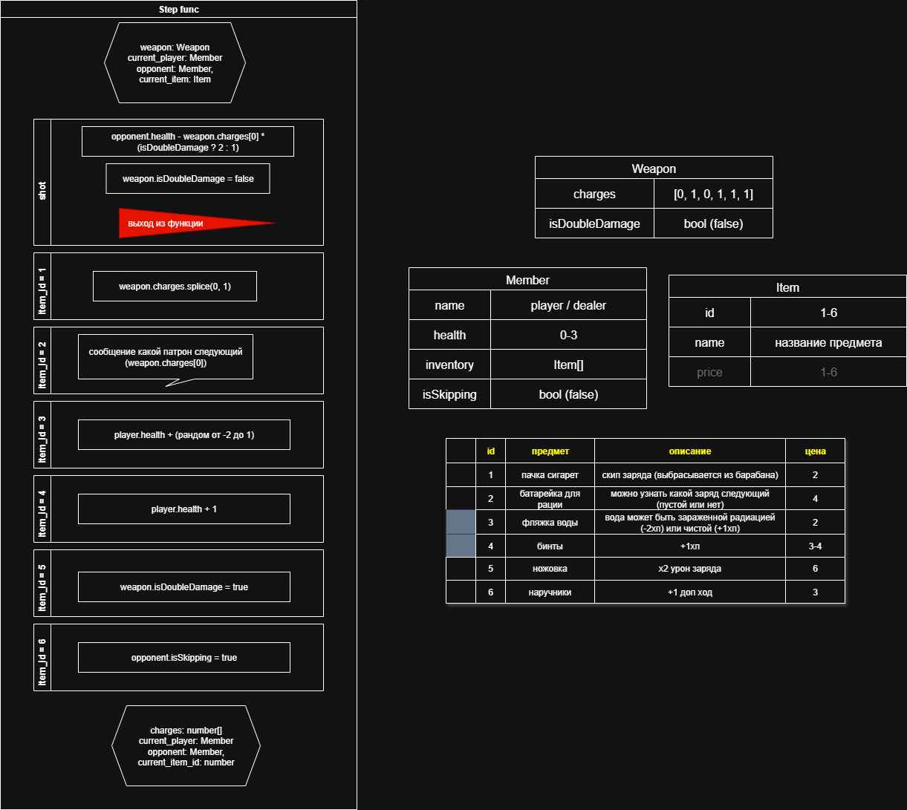

### Задачи на 18.10.2025
- [⭕] реализовать функцию шага игрока (любого)
---
- [    ] наверстать кнопки игрока для ходов
- [    ] реализовать отображение пошаговости (перехода между действиями и шагами)

### Схема типов и основной функции

